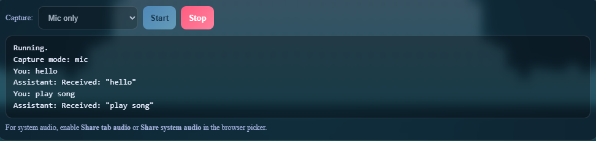
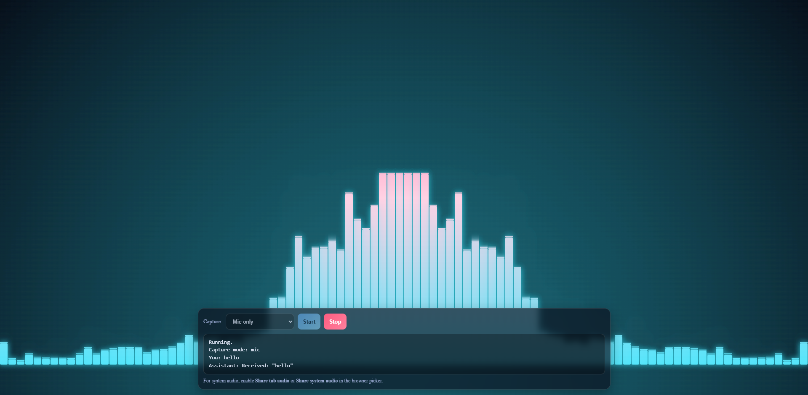
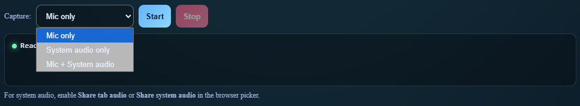

## Audio Visualizer with Speech Recognition

This project is a real-time audio visualizer combined with speech recognition.

It captures microphone or system audio, visualizes the sound frequencies, and converts speech into text using browser-based speech recognition.

### Features

- Real-time audio visualization
- Microphone and system audio capture
- Speech-to-text recognition
- Clean interactive UI
- Start/Stop recording controls

## Screenshots

### Main Interface
Shows the main UI of the audio visualizer with microphone capture enabled.

---

### Audio Visualizer
Real-time frequency bars reacting to microphone or system audio input.

---

### Capture Mode Options
Users can choose between microphone input, system audio, or both.

---

### Speech Recognition Output
Displays the recognized speech text and assistant responses in real time.

